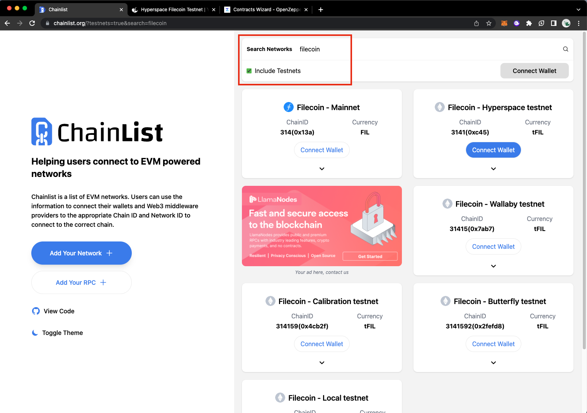
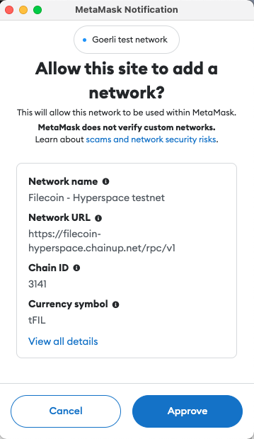
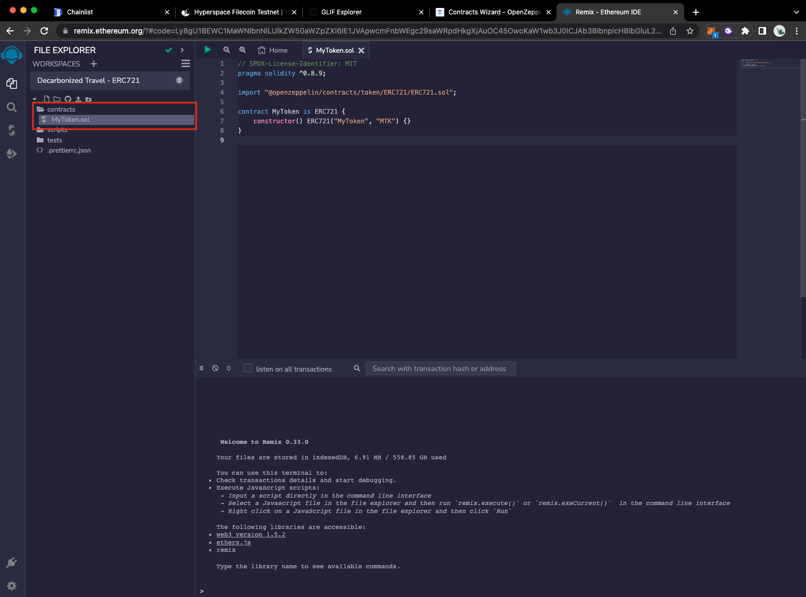
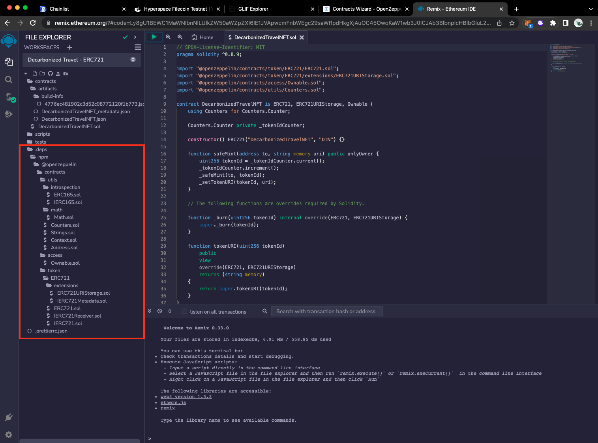
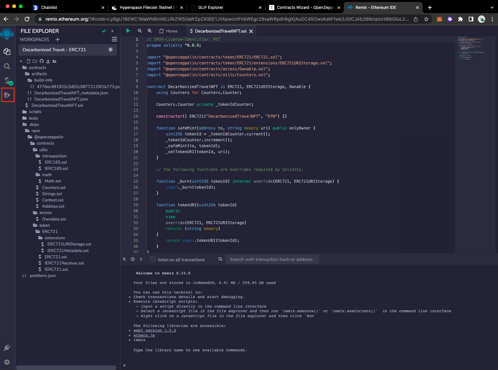
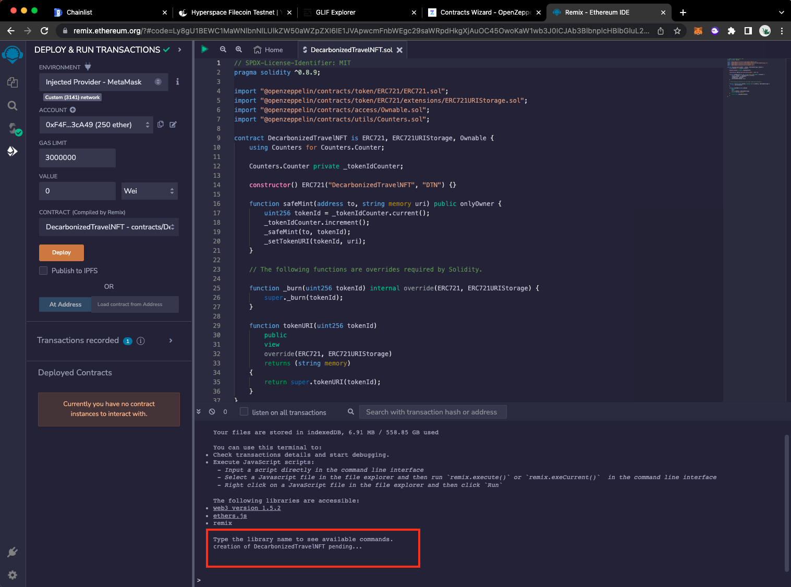
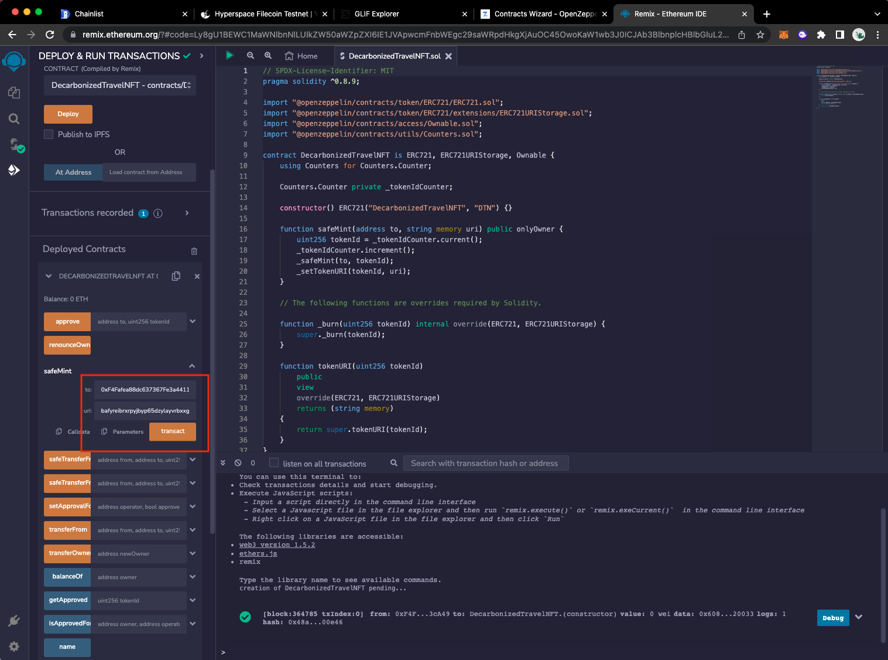
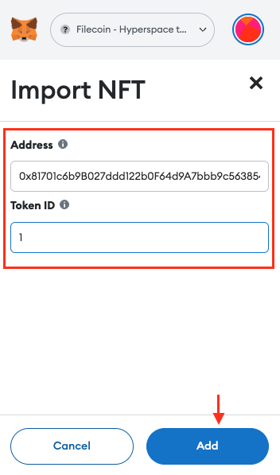

# 🗻 Decarbonize Your Travel

Create, mint, and deploy an NFT to decarbonize your travel using Co2.storage, the FVM Hyperspace Testnet & Remix:

## Overview

1. Create your Decarbonized Travel Asset using [form.co2.storage. ](https://form.co2.storage/bafyreieix4zyonwaxh4xjz4yh3qen5x35fhhwgm5vtnyn4svzms4wqxpl4?metadata=false)
2. Connect to the Filecoin Hyperspace testnet & get some TFIL from the faucet
3. Create & customize a DecarbonizedTravelNFT Contract in Solidity using [Open Zeppelin Contracts Wizard](https://docs.openzeppelin.com/contracts/4.x/wizard)
4. Deploy the DecarbonizedTravelNFT Contract to the Filecoin Virtual Machine (FVM) [Hyperspace Testnet](https://hyperspace.yoga/) with Remix
5. Interact with the DecarbonizedTravelNFT Contract & mint your NFT using the asset created on co2.storage.

## Create your Decarbonized Travel Asset using form.co2.storage

For this tutorial, we'll be creating an NFT that represents your travel decarbonized on the Filecoin Network.&#x20;

1. Fill out the first three fields of the [decarbonization form](https://docs.google.com/spreadsheets/d/1fCIkd8hSgys7Rjwoy8gS6P3H\_QgjqXlXT\_pd4-FYkh0/edit?usp=sharing).
   * **Attendee Name** is your name
   * **Emissions Description** is a short summary of the travel you are decarbonizing, including your name, the event, and the mode of travel
   * **Emissions Amount kg** is the amount of CO2 emitted by your travel. For flights, use the [ICAO Calculator](https://applications.icao.int/icec).
2. We will retire an offset for you on the Regen Network and add its transaction hash in the sheet. If you want to look it up, use the explorer at https://www.mintscan.io/regen/txs/\<TxHash> ([example](https://www.mintscan.io/regen/txs/AEA40C380617B7CEE1A018AD9638A06DD0C5E135A8993DDB5E16C620BF8F4651))
3. Complete the [decarbonized travel form](https://form.co2.storage/bafyreieix4zyonwaxh4xjz4yh3qen5x35fhhwgm5vtnyn4svzms4wqxpl4?metadata=false) to generate an asset on Co2.storage attesting that your travel was decarbonized. In the provenance section, enter your name and choose CC-O.
4. Note the CID (Content Identifier) that is returned. We'll need this CID later when we mint the NFT.

\
Connect to the Filecoin Hyperspace testnet & get some TFIL from the faucet&#x20;
--------------------------------------------------------------------------------

We need to point your wallet to the Filecoin Network, specifically the [Hyperspace testnet. ](https://docs.filecoin.io/networks/hyperspace/details/)We’ll use a website called [chainlist.org](http://chainlist.org) to give MetaMask the information it needs quickly.

#### Connect to the Filecoin Hyperspace testnet

1. Go to [chainlist.org](https://chainlist.org/) & enable the Testnets toggle and enter <mark style="background-color:yellow;">**Filecoin**</mark> into the search bar.

<figure><figcaption></figcaption></figure>

2. Scroll down to find the Filecoin – Hyperspace testnet & connect your wallet to the testnet.

<figure><figcaption></figcaption></figure>

3. Connect network through Metamask & approve when prompted:



In MetaMask click Next:





Click Connect:

\
.png>)



Click Approve when prompted to Allow this site to add a network:

\




Click Switch network when prompted by MetaMask:





You should see the Filecoin Hyperspace testnet listed at the top. Now that we’ve got the Filecoin Hyperspace testnet set up within MetaMask. You’ll notice that your MetaMask window shows **0 TFIL**



#### &#x20;Get some TFIL from the faucet:

Test-filecoin (**TFIL**) is **FIL** that has no value in the real world, and developers use it for testing. We’ll grab some **TFIL** now.



Go to [hyperspace.yoga](https://hyperspace.yoga/) and click Faucet from the menu:

<figure><figcaption></figcaption></figure>



Paste your address into the address field, complete the I am human captcha, and then click Send:

<figure><figcaption></figcaption></figure>



The faucet should give you a link to the transaction:

<figure><figcaption></figcaption></figure>



The block explorer will show you the transaction history for your address. After a couple of minutes, you should see 250 **tFIL** transferred to your address:

<figure><figcaption></figcaption></figure>



Open MetaMask to confirm that you received the tFIL:\
\
\




## Create a DecarbonizedTravelNFT Contract in Solidity

The DecarbonizedTravelNFT Smart Contract is based on Open Zeppelin's implementation of ERC721 but uses the ERC721URIStorage version, which includes the metadata standard extensions (so we can pass in our IPFS-addressed metadata - which we've saved on CO2.Storage, to the contract).

We'll be using the Open Zeppelin Contracts Wizard to create our DecarbonizedTravelNFT Contract. Follow along below 👇🏼.


#### Using  Open Zeppelin Contracts Wizard:



Head to the Open Zeppelin wizard and select the option for ERC721 as seen below.

* Provide this URL as the base URI for the contract:\
  [https://ipfs.io/ipfs/QmWAtvTBkUKeifvUSu6XA2uFDUQBgmL3U1pTnbgqrHhton?filename=decarbonized%20travel%20photo.png](https://ipfs.io/ipfs/QmWAtvTBkUKeifvUSu6XA2uFDUQBgmL3U1pTnbgqrHhton?filename=decarbonized%20travel%20photo.png)

<figure><figcaption></figcaption></figure>



Name your token and specify its symbol. For this tutorial, our ERC721 token is DecarbonizedTravelNFT, and the symbol is DTN.

<figure><figcaption></figcaption></figure>



Next, add a few selections in the Features Section:

* Mintable to ensure that new tokens are mintable.&#x20;
* Auto Increment Ids to create a serial identifier for each token
* URI Storage to allow for the updating of token URIs for individual token IDs

<figure><figcaption></figcaption></figure>



#### The DecarbonizedTravelNFT Contract:


```javascript
// SPDX-License-Identifier: MIT
pragma solidity ^0.8.9;

import "@openzeppelin/contracts/token/ERC721/ERC721.sol";
import "@openzeppelin/contracts/token/ERC721/extensions/ERC721Enumerable.sol";
import "@openzeppelin/contracts/token/ERC721/extensions/ERC721URIStorage.sol";
import "@openzeppelin/contracts/access/Ownable.sol";
import "@openzeppelin/contracts/utils/Counters.sol";

contract DecentralizedTravelNFT is ERC721, ERC721Enumerable, ERC721URIStorage, Ownable {
    using Counters for Counters.Counter;

    Counters.Counter private _tokenIdCounter;

    constructor() ERC721("DecentralizedTravelNFT", "DTN") {}

    function _baseURI() internal pure override returns (string memory) {
        return "https://ipfs.io/ipfs/QmWAtvTBkUKeifvUSu6XA2uFDUQBgmL3U1pTnbgqrHhton?filename=decarbonized%20travel%20photo.png";
    }

    function safeMint(address to, string memory uri) public onlyOwner {
        uint256 tokenId = _tokenIdCounter.current();
        _tokenIdCounter.increment();
        _safeMint(to, tokenId);
        _setTokenURI(tokenId, uri);
    }

    // The following functions are overrides required by Solidity.
    function _beforeTokenTransfer(address from, address to, uint256 tokenId, uint256 batchSize)
        internal
        override(ERC721, ERC721Enumerable)
    {
        super._beforeTokenTransfer(from, to, tokenId, batchSize);
    }

    function _burn(uint256 tokenId) internal override(ERC721, ERC721URIStorage) {
        super._burn(tokenId);
    }

    function tokenURI(uint256 tokenId)
        public
        view
        override(ERC721, ERC721URIStorage)
        returns (string memory)
    {
        return super.tokenURI(tokenId);
    }

    function supportsInterface(bytes4 interfaceId)
        public
        view
        override(ERC721, ERC721Enumerable)
        returns (bool)
    {
        return super.supportsInterface(interfaceId);
    }
}
```


## Deploy the DecarbonizedTravelNFT Contract to the Filecoin Virtual Machine (FVM) Hyperspace Testnet

#### &#x20;Requirements

We'll be deploying this contract to the Filecoin Virtual Machine Hyperspace Testnet. To deploy to Hyperspace Testnet we'll need to have:

1. Set up & connected Metamask Wallet to Hyperspace Testnet
2. Received some test tFIL funds from a faucet (Yoga or Zondax)

#### Create your workspace

The development environment we’re going to be using is called [Remix](https://remix.ethereum.org). Let’s create a new workspace to create our ERC-721 Decarbonized Travel NFT.



Open [remix.ethereum.org](https://remix.ethereum.org/) & click the + icon next to Workspaces to create a new workspace:

<figure><figcaption></figcaption></figure>



In the Choose a template dropdown, select ERC 721. Enter a name in the Workspace name field. Anything like **Decarbonized Travel - ERC 721** works fine.\


<figure><figcaption></figcaption></figure>



#### Customize the Decarbonized NFT contract



In the editor panel, replace MyToken with whatever you’d like to name your NFT Contract. In this example, we’ll use DecarbonizedTravelNFT.\


<figure><figcaption></figcaption></figure>



Go ahead and copy the code you’ve created using the Contract Wizard into Remix under the contract directory, where there is now **DecarbonizedTravelNFT.sol**.

<figure><figcaption></figcaption></figure>



#### Compile the Decarbonized NFT contract



Click the green play symbol at the top of the workspace to compile your contract. You can also press CMD + s on MacOS or CTRL + s on Linux and Windows.

<figure><figcaption></figcaption></figure>



Remix automatically fetches the two **import** contracts from the top of our .**sol** contract. You can see these imported contracts under the **.deps** directory. You can browse the contracts there, but Remix will not save any changes you make.

<figure><figcaption></figcaption></figure>



#### Deploy the Decarbonized NFT contract

Now that we’ve successfully compiled our contract, we need to deploy it to the Filecoin Hyperspace testnet! This is where our previous MetaMask setup comes into play.



Click the Deploy tab from the left.

<figure><figcaption></figcaption></figure>



Under the Environment dropdown, select Injected Provider - MetaMask.

<figure><figcaption></figcaption></figure>



MetaMask will open a new window confirming that you want to connect your account to Remix\
\
\
\
Click Next, then Connect your tFIL account to Remix.&#x20;

.png>)\




Back in Remix, under the Account field, you’ll see that it says something like <mark style="color:green;">**0xF4F...**</mark> (**250 ether**). This value is **250 tFIL**, but Remix doesn’t natively support the Filecoin network so doesn’t understand what **tFIL** is. This isn’t a problem, it’s just a little quirk of using Remix.

<figure><figcaption></figcaption></figure>



Under the Contract dropdown, ensure the contract you created is selected then click Deploy.

<figure><figcaption></figcaption></figure>



MetaMask will open a window and ask you to confirm the transaction. Scroll down and click Confirm to have MetaMask deploy the contract.

.png>)



Back in Remix, a message at the bottom of the screen shows that the creation of your token is pending.\
\
Wait around 90 seconds for the deployment to complete.

<figure><figcaption></figcaption></figure>

On the Filecoin network, a new set of blocks, also called a tipset, is created every thirty seconds. When deploying a contract, the transaction needs to be received by the network, and then the network needs to confirm the contract. This process takes around one to two tipsets to process – or around 60 to 90 seconds.\




## Interact with the DecarbonizedTravelNFT Contract & mint your NFT

Now that we’ve compiled and deployed the contract, it’s time to actually interact with it! We’re going to call a method within the deployed contract to mint an NFT.

#### &#x20;Mint your DecarbonizedTravelNFT



Back in Remix, open the Deployed Contracts dropdown, within the Deploy sidebar tab.

<figure><figcaption></figcaption></figure>



Expand the safeMint method. You must fill in two fields here: to and uri. The to field specifies where address you want this initial DecarbonizedTravelNFT sent to. Open MetaMask, copy your address, and paste it into this field. For the uri, provide the CID of your travel asset on Co2.storage.

<figure><figcaption></figcaption></figure>



Click Transact. MetaMask will open a window and ask you to confirm the transaction:\
\
Again, you must wait for the network to process the transaction, which should take about 90 seconds. You can move on to the next section while you’re waiting.

<figure><figcaption></figcaption></figure>



#### Add to Metamask & import your NFT:

Currently, MetaMask has no idea what our NFT is or what it even does. We can fix this by explicitly telling MetaMask the address of our contract.



Go back to Remix and open the Deploy sidebar tab. Under Deployed Contracts, you should see your contract address at the top. Click the copy icon to copy the address to your clipboard:

<figure><figcaption></figcaption></figure>



Open MetaMask, select NFTs, and click Import your NFT:

<figure><figcaption></figcaption></figure>



In the Token contract address field, paste the contract address you just copied from Remix and then click Add custom token. \
\
MetaMask should autofill the rest of the information based on what it can find from the Filecoin network. Click Import NFT.

<figure><figcaption></figcaption></figure>



✨ You should now be able to see that you have 1 Decarbonized Travel NFT within your wallet! ✨
