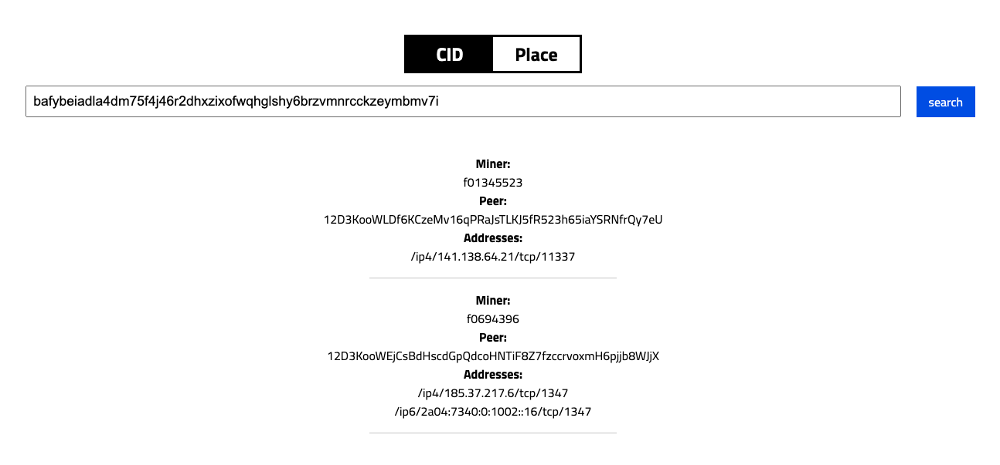

# 🖥 Filecoin Green UI Tools

## [CID.place](https://cid.place)

[<mark style="color:green;">https://cid.place/bafybeiadla4dm75f4j46r2dhxzixofwqhglshy6brzvmnrcckzeymbmv7i</mark>](https://cid.place/bafybeiadla4dm75f4j46r2dhxzixofwqhglshy6brzvmnrcckzeymbmv7i)<mark style="color:green;"></mark>

Find Storage Providers hosting your CIDs:


[cid.place.md](cid.place.md)


## [REC Browser](https://green.filecoin.space/eac-browser/)

[<mark style="color:green;">https://green.filecoin.space/eac-browser/</mark>](https://green.filecoin.space/eac-browser/)<mark style="color:green;"></mark>

Browse Renewable Energy Certificates and related metadata:


[rec-browser.md](rec-browser.md)


## [Metered Energy Consumption](https://green.filecoin.space/metered-energy-consumption/)

[<mark style="color:green;">https://green.filecoin.space/metered-energy-consumption/</mark>](https://green.filecoin.space/metered-energy-consumption/)<mark style="color:green;"></mark>

Search trough Storage Providers' energy consumption by HW components and racks:


[metered-energy-consumption.md](metered-energy-consumption.md)


## [CSV Export utility](https://green.filecoin.space/audit/)

[<mark style="color:green;">https://green.filecoin.space/audit/</mark>](https://green.filecoin.space/audit/)<mark style="color:green;"></mark>

Export Storage Providers' energy consumption:

.png>)


[csv-export-utility.md](csv-export-utility.md)

