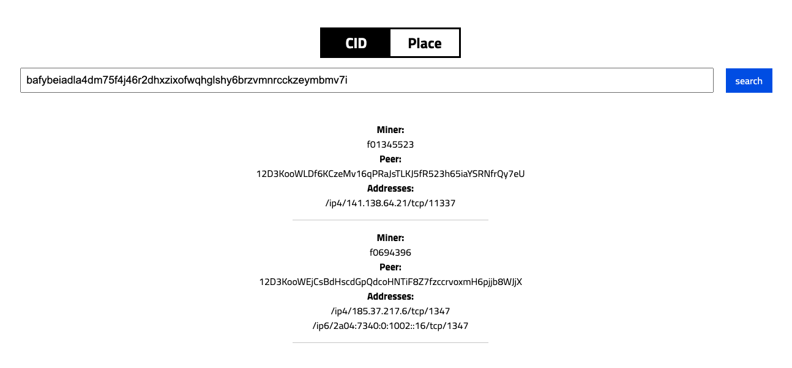

# 🔍 CID.place

[<mark style="color:green;">https://CID.place</mark>](https://cid.place)<mark style="color:green;"></mark>


Example URL where CID is not placed in URL



Example where CID is placed in URL



**Github repo:** [adgsm/cid.place](https://github.com/adgsm/cid.place)



CID.place Github repo

